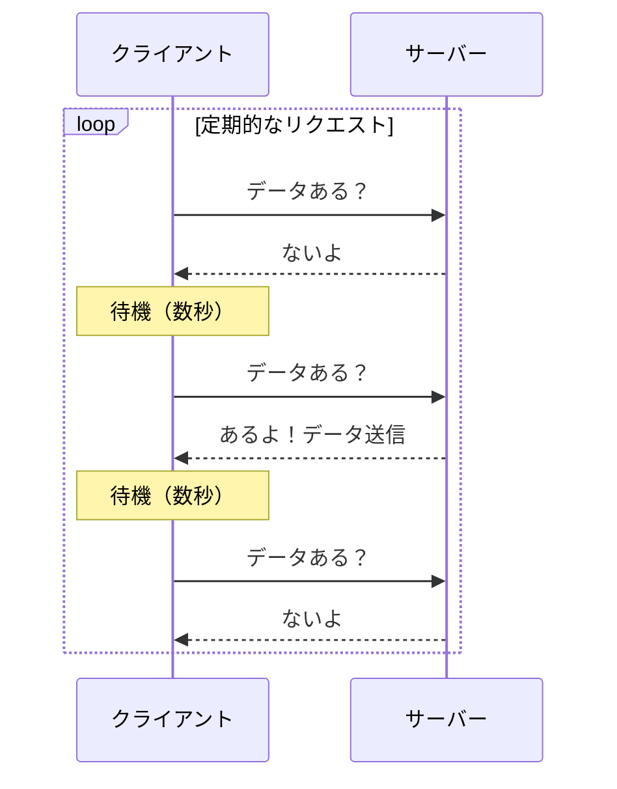
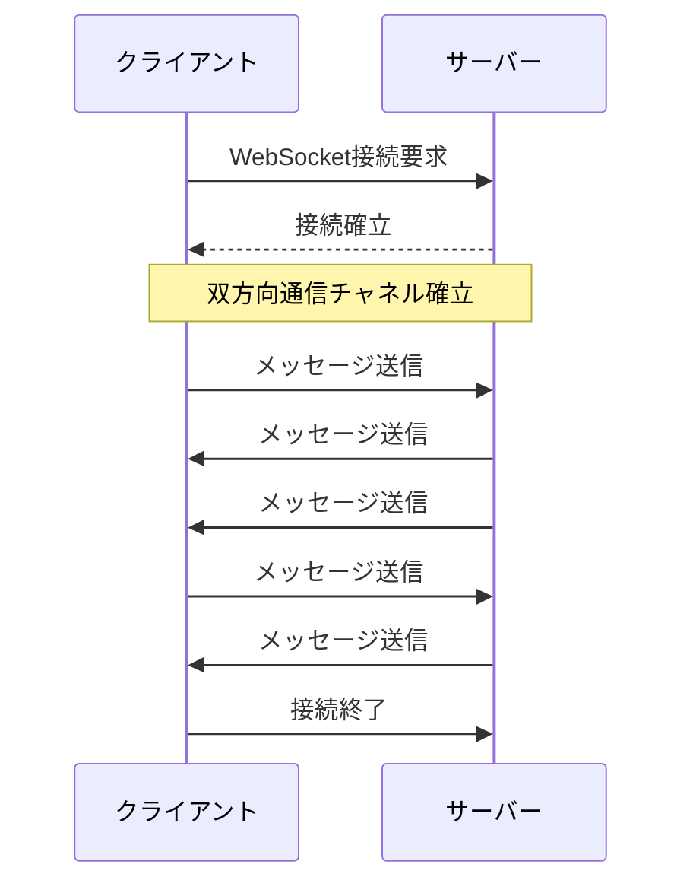
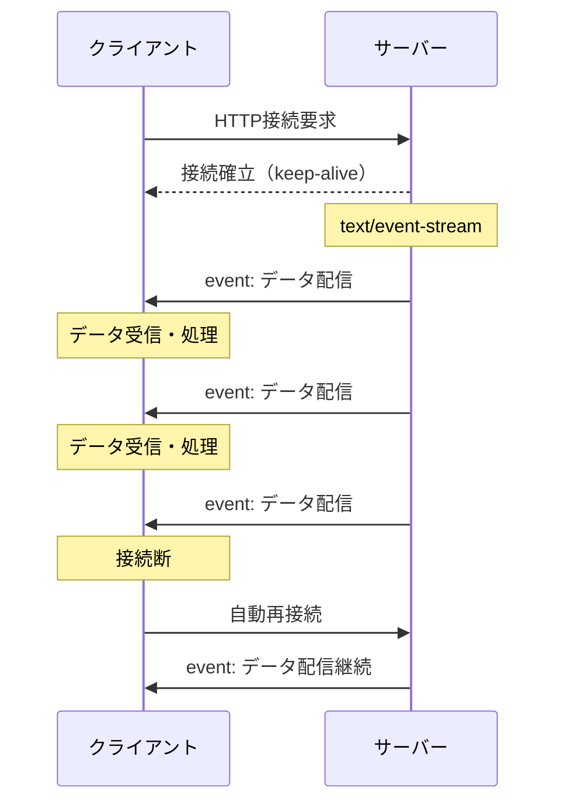

# SSE（Server-Sent Events）でリアルタイム通信を実現する

## SSE（Server-Sent Events）とは

Server-Sent Eventsは、サーバーからクライアントへの一方向リアルタイム通信を実現するWeb標準技術です。

従来のHTTP通信では、クライアントがリクエストを送信し、サーバーがレスポンスを返すという一往復で通信が完了していました。

リアルタイム通信では、この制約を超えて、サーバー側からクライアントへ能動的にデータをプッシュしたり、接続を維持したまま継続的にデータをやり取りすることが可能になります。

### 基本的な特徴
- HTTP/HTTPSプロトコルを使用
- サーバー → クライアントの単方向通信
- テキストベースのデータストリーム
- EventSourceというブラウザAPIで実装
- 自動再接続機能を標準搭載

### 仕組み
1. クライアントがHTTPリクエストを送信
2. サーバーは接続を維持したまま、イベントを送信
3. `Content-Type: text/event-stream`でレスポンス
4. データは`data: `プレフィックスで送信

## 利用シーン

SSEが特に適している場面は、サーバーからクライアントへの一方向配信で十分なケースです。

### 実用例

- **AIチャットの応答**
  - ストリーミング形式での文章生成
  - リアルタイムでの回答表示
- **SNSのタイムライン更新**
  - 新しい投稿の通知
  - いいね数のリアルタイム更新
  
- **金融情報の配信**
  - 株価のリアルタイム表示
  - 為替レートの更新
  
- **モニタリングダッシュボード**
  - サーバーメトリクスの表示
  - アプリケーションログの配信
  
- **ライブ情報の配信**
  - スポーツのスコア更新
  - オークションの入札状況

## 同じリアルタイム通信であるポーリング、WebSocketとの違い

### ポーリング（Polling）



```
クライアント → サーバー : データある？
サーバー → クライアント : ないよ
（数秒後）
クライアント → サーバー : データある？
サーバー → クライアント : あるよ！
```

**特徴**
- 実装がシンプル
- サーバー負荷が高い
- リアルタイム性に限界

### WebSocket



```
クライアント ⇄ サーバー : 双方向通信チャネル確立
```

**特徴**
- 双方向通信が可能
- 低レイテンシ
- 専用プロトコル（ws://、wss://）
- ファイアウォールで制限される可能性

### SSE



```
クライアント → サーバー : 接続確立
サーバー → クライアント : データ配信（継続的）
```

**特徴**
- 実装が簡単
- HTTPプロトコルを使用
- 自動再接続
- テキストデータのみ

### 比較表

| 項目 | ポーリング | WebSocket | SSE |
|------|-----------|-----------|-----|
| 通信方向 | リクエスト/レスポンス | 双方向 | サーバー→クライアント |
| プロトコル | HTTP/HTTPS | WS/WSS | HTTP/HTTPS |
| リアルタイム性 | △ | ◎ | ○ |
| 実装難易度 | 簡単 | 複雑 | 簡単 |
| サーバー負荷 | 高 | 低 | 低 |


## SSEの実装

### サーバー側（Node.js/Express）
```javascript
app.get('/events', (req, res) => {
  // SSE用のヘッダー設定
  res.writeHead(200, {
    'Content-Type': 'text/event-stream',
    'Cache-Control': 'no-cache',
    'Connection': 'keep-alive'
  });

  // データ送信
  const sendEvent = (data) => {
    // 通常の通信ではres.writeして、res.sendで送信する
    // SSEでは、Node.jsがストリーミングモードと認識
    // バッファリングを無効化
    res.write(`data: ${JSON.stringify(data)}\n\n`);
  };

  // 定期的にイベント送信
  const interval = setInterval(() => {
    sendEvent({
      time: new Date().toISOString(),
      message: 'サーバーからの更新'
    });
  }, 3000);

  // クライアント切断時の処理
  req.on('close', () => {
    clearInterval(interval);
  });
});
```

### クライアント側（JavaScript）
```javascript
const eventSource = new EventSource('/events');

// メッセージ受信時の処理
eventSource.onmessage = (event) => {
  const data = JSON.parse(event.data);
  console.log('受信:', data);
  
  // UIを更新
  updateUI(data);
};

// エラー処理
eventSource.onerror = (error) => {
  console.error('SSEエラー:', error);
};

// 特定のイベントタイプを受信
eventSource.addEventListener('notification', (event) => {
  showNotification(event.data);
});
```

### イベントのフォーマット
```
id: 123
event: notification
retry: 3000
data: {"message": "新着メッセージ"}

data: 複数行のデータは
data: このように送信します
```

## 注意点・制限

### 技術的な制限
1. **同時接続数の制限**
   - ブラウザごとに同一ドメインへの接続数制限（通常6接続）
   - HTTP/2を使用することで回避可能

2. **テキストデータのみ**
   - バイナリデータは送信不可
   - 画像等はBase64エンコードが必要

3. **一方向通信**
   - クライアントからサーバーへは別途HTTPリクエストが必要

### 実装上の注意点
1. **プロキシ・ロードバランサー**
   - タイムアウト設定の調整が必要
   - バッファリングの無効化

2. **認証・セキュリティ**
   - CookieやAuthorizationヘッダーでの認証
   - CORS設定の考慮

3. **エラーハンドリング**
   - ネットワーク切断時の再接続処理
   - サーバー側のリソース管理

### ブラウザサポート
- モダンブラウザは全て対応
- IE/Edge（レガシー）は未対応
- ポリフィルで対応可能

## まとめ

### SSEを選ぶべき場面
✅ サーバーからの一方向配信で十分
✅ HTTPインフラをそのまま活用したい
✅ シンプルな実装を重視
✅ 自動再接続機能が必要

### SSEを避けるべき場面
❌ 双方向のリアルタイム通信が必要
❌ バイナリデータの送信が必要
❌ 超低遅延が要求される
❌ 大量の同時接続が必要

### 結論
SSEは、サーバーからのプッシュ配信に特化したシンプルで実用的な技術です。WebSocketほど高機能ではありませんが、多くのリアルタイム配信のユースケースでは十分な性能を発揮します。

既存のHTTPインフラを活用でき、実装も簡単なため、まずはSSEから始めて、必要に応じてWebSocketへ移行するという選択も有効です。

**「適材適所でリアルタイム通信技術を選択しよう！」**