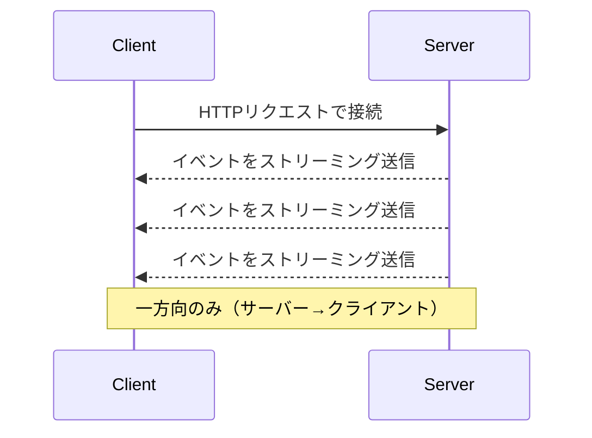
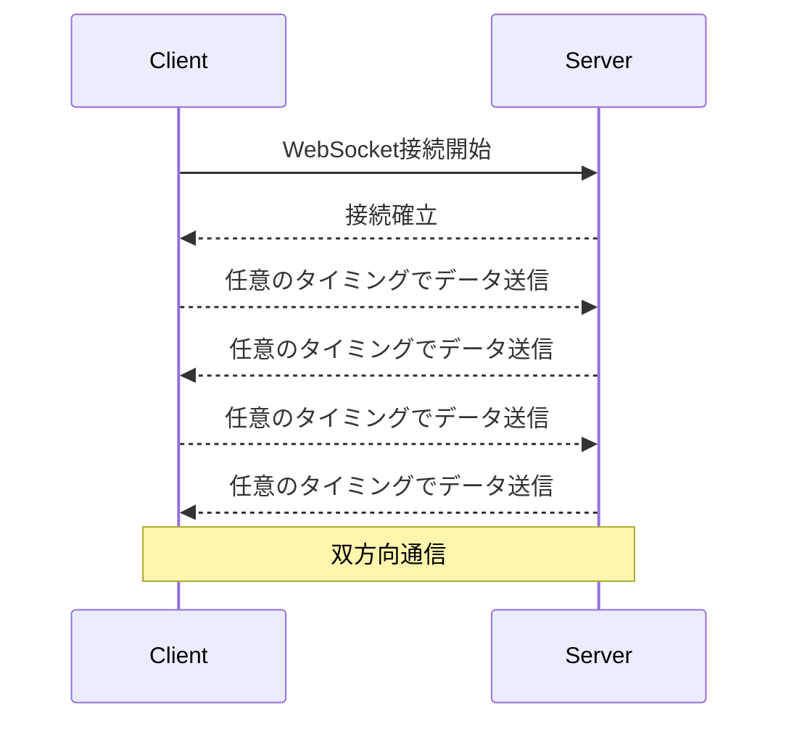
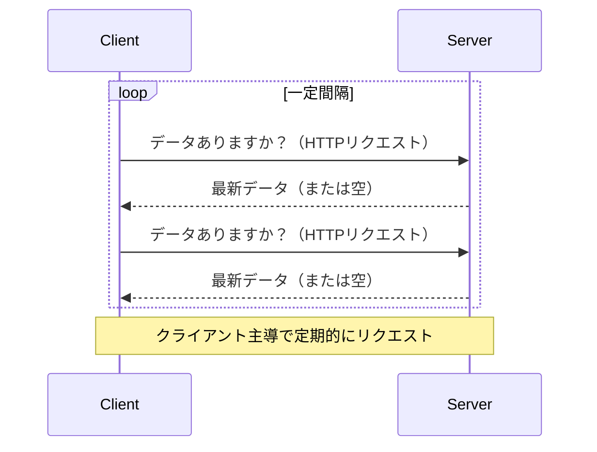

# サーバー送信イベント（SSE）LT資料

---

## 1. サーバー送信イベント（SSE）とは

- サーバーからクライアント（主にWebブラウザ）へ一方向にリアルタイムでデータを送信する仕組み
- HTTP接続を利用し、クライアントが一度接続するとサーバーからのデータをストリーミングで受信
- 主な用途：通知、ライブデータ更新など

---

## 2. SSEの特徴・メリット

- 一方向通信（サーバー→クライアント）
- HTTPベースでファイアウォールやプロキシを通りやすい
- `EventSource` APIで簡単に利用・主要ブラウザ対応
- ポーリングより効率的・サーバー負荷が低い
- 自動再接続機能あり

---

## 3. SSEの利用シーン

- 通知システム
- ライブデータ更新（株価、天気、スポーツ速報など）
- 管理画面のリアルタイム反映

---

## 4. SSEの実装例（Node.js／Express）

### サーバー側（Node.js/Express）

```js
const express = require('express');
const app = express();
const port = 3000;

app.get('/sse', (req, res) => {
  res.setHeader('Content-Type', 'text/event-stream');
  res.setHeader('Cache-Control', 'no-cache');
  res.setHeader('Connection', 'keep-alive');
  setInterval(() => {
    const data = JSON.stringify({ message: 'Hello!', time: new Date().toISOString() });
    res.write(`data: ${data}\n\n`);
  }, 1000);
});

app.listen(port, () => {
  console.log(`SSE server running at http://localhost:${port}`);
});
```

### クライアント側（JavaScript）

```js
const eventSource = new EventSource('/sse');
eventSource.onmessage = (e) => {
  const data = JSON.parse(e.data);
  console.log(data);
};
```

---

## 5. SSE・WebSocket・Long Pollingの比較

| 項目         | SSE                       | WebSocket                 | Long Polling                |
|--------------|---------------------------|---------------------------|-----------------------------|
| 通信方向     | 一方向（サーバー→クライアント） | 双方向                    | 一方向（クライアント→サーバー）|
| プロトコル   | HTTP（text/event-stream） | 独自プロトコル（ws/wss）  | HTTP                        |
| 接続         | 常時接続                  | 常時接続                  | リクエストごとに接続        |
| リアルタイム性| 高                        | 非常に高                  | 中〜低                      |
| 実装         | 簡単                      | やや複雑                  | 簡単                        |
| 用途         | 通知、ライブ更新          | チャット、ゲーム           | シンプルな更新確認、レガシー |

---

## 6. 通信イメージ図（Mermaid記法）

#### SSE



#### WebSocket



#### Long Polling



---

## 7. 注意点・制限

- 一方向通信のみ（クライアント→サーバーは別途HTTPリクエスト）
- 同時接続数制限（ブラウザごとに6接続程度）
- プロキシや中継サーバーによる切断の可能性
- バイナリデータ送信不可（テキストのみ）

---

## 8. まとめ

- SSEは通知やライブ更新に最適なシンプルなリアルタイム通信手段
- 双方向通信はWebSocket、レガシー環境や単純な用途はLong Pollingも選択肢
- 用途や要件に合わせて使い分けることが重要

---

## 参考文献

- [MDN Web Docs - Using server-sent events](https://developer.mozilla.org/en-US/docs/Web/API/Server-sent_events/Using_server-sent_events)
- [Long Polling vs Server-Sent Events vs WebSockets: A Comprehensive Guide](https://medium.com/@asharsaleem4/long-polling-vs-server-sent-events-vs-websockets-a-comprehensive-guide-fb27c8e610d0)